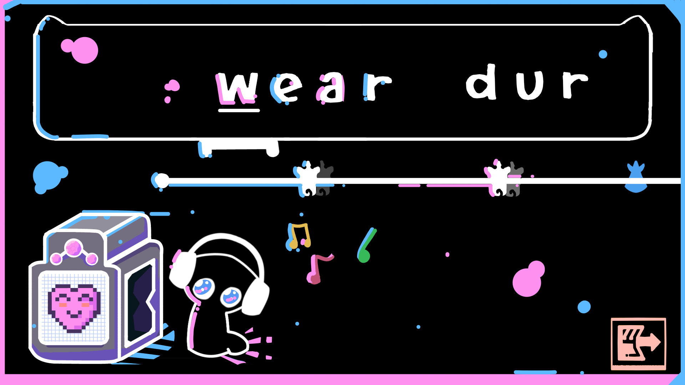

# noki

## What is this?

**noki** is a rhythm game engine that generates playable typing levels from:
- any audio file
- any list of words

Instead of hand-designing levels, the system analyzes the music and constructs a beatmap automatically.

---

## Running locally

Clone the repo:
`git clone https://github.com/EthanChen5291/noki_rhythm_engine.git`

Enter the project:
`cd noki_rhythm_engine`

Install dependencies:
`pip install -r requirements.txt`

Run the game:
`python main.py`

---

## Why I built this

Most rhythm games rely on handcrafted maps. They feel great, but they don’t scale.

I wanted to explore:
> how close you can get to that “handmade feel” using deterministic systems + audio analysis

The focus is on:
- timing that actually matches the music
- input patterns that feel natural to type
- controlled randomness so levels don’t feel robotic

---

## What it does

- analyzes audio to estimate BPM, intensity, and structure
- generates note timing aligned to beats and sub-beats
- maps words into input sequences that are playable and ergonomic
- adjusts scroll speed and density based on musical intensity

You can drop in your own:
- audio file
- word bank

and get a fully playable level.

---

## Key systems

**Audio analysis**
- BPM detection + normalization
- sub-beat intensity calculation
- section-based intensity tracking

**Beatmap generation**
- deterministic timing with controlled variation
- intensity-driven note density
- pattern shaping based on rhythm structure

**Gameplay**
- typing-based input mapped to rhythm
- dynamic scroll speed
- real-time feedback and animations

---

## Tech

- Python
- Pygame
- NumPy / audio processing tools

---

## Limitations

- generated maps are not always as polished as handcrafted ones
- audio analysis can struggle with complex or messy tracks